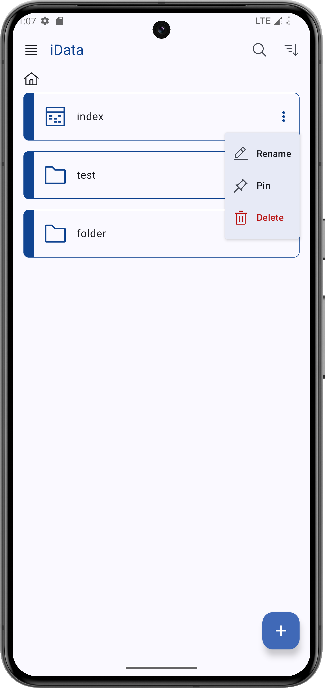
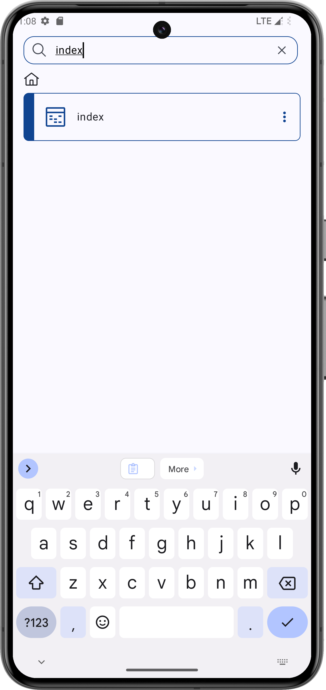
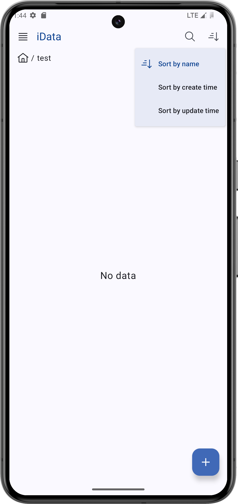
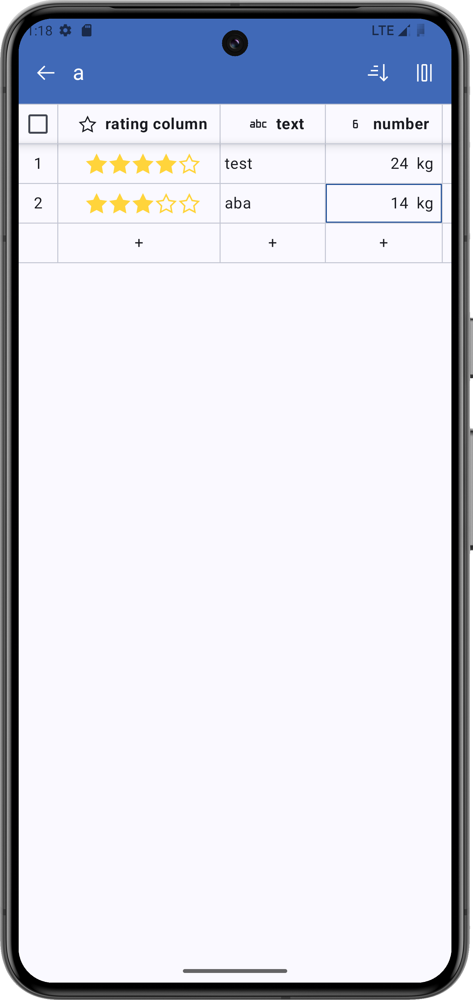
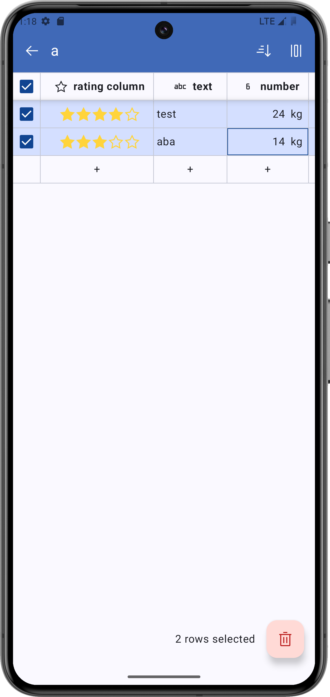
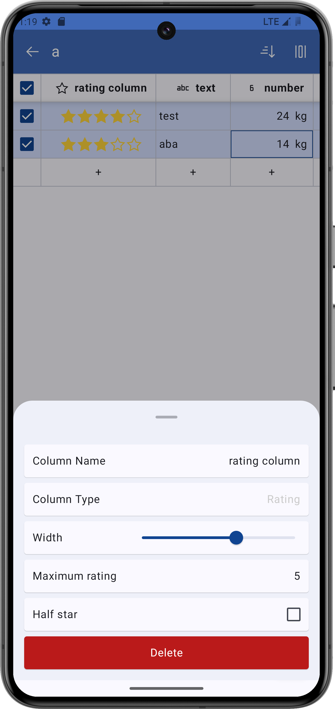
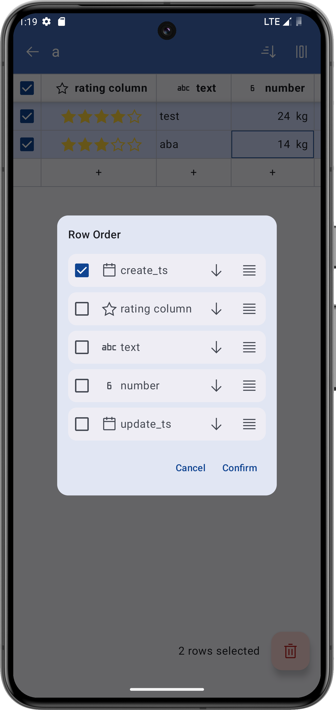
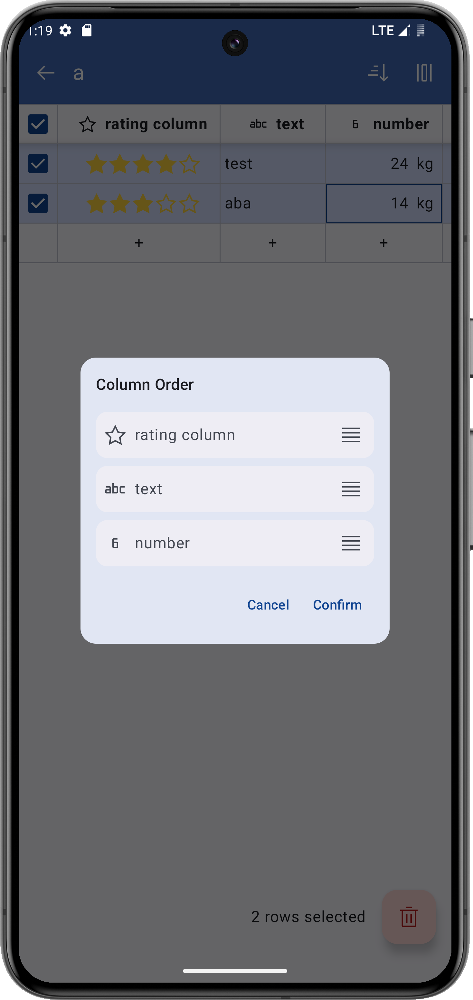
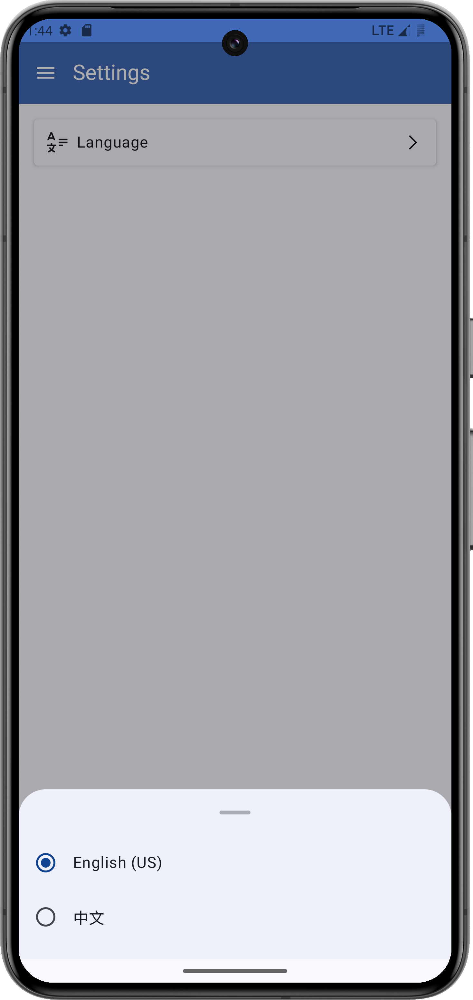

# iData (WIP...)

One App to manage all your data.

## Features

- Privacy-protection: All data is stored locally on your device.
- Diverse Data Support: Support for various types of records like bills, movie reviews, workout logs, notes, and more for comprehensive information management..

## Some screenshots

    
    
    
    
    
    
    
    
    

